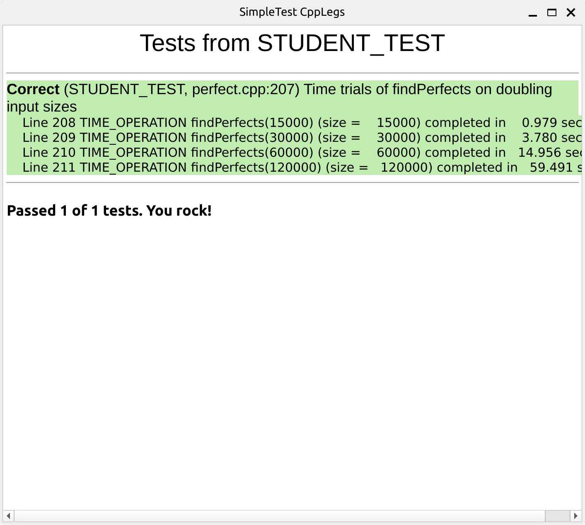
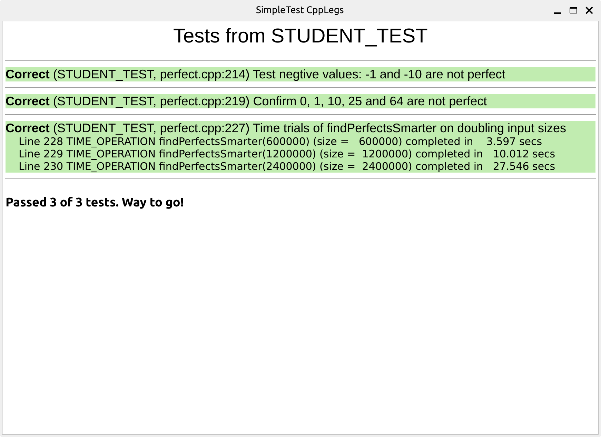
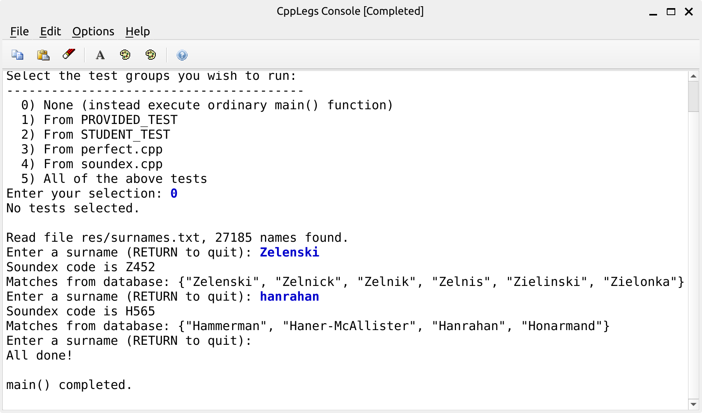

# assignment 1

刘康

# Q0

执行时间: 10s

完美数有 4 个

```c
Found perfect number: 6
Found perfect number: 28
Found perfect number: 496
Found perfect number: 8128
...
Done searching up to 40000
```

# Q1

代码片段

```c
STUDENT_TEST("Time trials of findPerfects on doubling input sizes") {
    TIME_OPERATION(15000, findPerfects(15000));
    TIME_OPERATION(30000, findPerfects(30000));
    TIME_OPERATION(60000, findPerfects(60000));
    TIME_OPERATION(120000, findPerfects(120000));
}
```

输出结果: 



| 最大数目 | 使用时间 (s) |
| --- | --- |
| 15000 | 0.979 |
| 30000 | 3.780 |
| 60000 | 14.956 |
| 120000 | 59.491 |

可以看到，数目每增加一倍，时间是之前的 4 倍

# Q3

对于 10 与 1000，计算 **`isPerfect`**是否做了同样多的工作？为什么一样多，或者为什么不一样多？

答: 不一样多。因为 `isPerfect` 需要遍历从 1 到最大指定数目 $n$ 中间的所有正整数，并判断该整数是否是 $n$ 的余数。因此计算次数和 $n$ 成正比例关系

对于搜索范围为 1-1000 的数，**`findPerfect`**其工作量是否与 1000-2000 时一致？为什么一样多，或者为什么不一样多？

答: 不一样多。因为 `findPerfect` 调用的是 `isPerfect` 来判断指定数目 $n$ 是否是完美数。而 `isPerfect` 与 $n$ 成正比例关系。因此 1000 - 2000 的计算远大于 1 - 1000 的计算。

# Q4

120000 对应 59.5 s

计算如下: 

$$
\Big( \cfrac {33000000}{120000} \Big )^2 * 59.5 = 4499687.5 s \approx 1250 h 
$$

# Q5

把 **`total`** 的初始值从 0 改为 1，这将给 **`divisorSum`** 引入一个 Bug。重新编译运行一次，可以观察下测试错误时，将会如何报错。

这个函数测试失败时，其他测试是否还能通过？为什么？

答: 测试不能通过。因为 `isPerfect` 会调用 `divisorSum` 函数。而 `divisorSum` 中除 0 会报错

# Q6

测试开平方为整数的值是否正常，比如 25, 64

测试开平方不为整数的值是否正常，比如 8, 20

测试小于 1 的值是否正常，比如 0, 1

```c
STUDENT_TEST("Confirm 0, 1, 10, 25 and 64 are not perfect") {
    EXPECT(!isPerfectSmarter(0));
    EXPECT(!isPerfectSmarter(1));
    EXPECT(!isPerfectSmarter(10));
    EXPECT(!isPerfectSmarter(25));
    EXPECT(!isPerfectSmarter(64));
}
```

# **Q7**

在表格中记录**`findPerfectsSmarter`**的执行时间。



| 最大数目 | 使用时间 (s) |
| --- | --- |
| 600000 | 3.597 |
| 1200000 | 10.012 |
| 2400000 | 27.546 |

# Q8

1200000 对应 10 s

计算如下: 

$$
\Big( \cfrac {33000000}{1200000} \Big )^{1.5} * 10 = 1442 s
$$

# Q9

阐述下你选择的测试案例的动机，解释下为什么你认为这几个测试可以确定函数 **`findNthPerfectEuclid`** 正常工作。

测试代码如下: 

```c
STUDENT_TEST("Test findNthPerfectEuclid") {
    EXPECT(isPerfect(findNthPerfectEuclid(1)));
    EXPECT(isPerfect(findNthPerfectEuclid(2)));
    EXPECT(isPerfect(findNthPerfectEuclid(3)));
    EXPECT(isPerfect(findNthPerfectEuclid(4)));
}
```

因为数学家已经证明了梅森素数和完美数的对应关系，因此只要我们找到了符合要求的梅森素数，就可以知道对应的完美数

# Q10

"Angelou" 的编码是多少呢？

答: A524

# Q11

简单描述一下你的分解过程。

答: 

1. 逐字符判断，判断每个字符是否是字母，非字母的字符去除
2. 将所有字母转换为大写
3. 根据编码方案将字母转换为数字
4. 去除所有相邻的冗余数字
5. 使用姓氏名的第一个字母替换第一个数字，并转换为大写形式
6. 删除编码中所有的数字 **0**
7. 通过填充 0 或截掉多余部分，使得编码长度恰好为 4.

# Q12 测试结果


