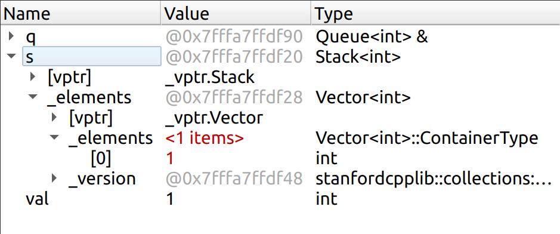
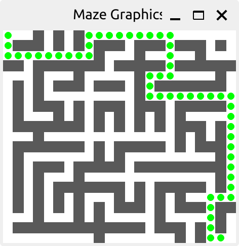

# Assignment 2
姓名: 刘康

### Q1 在调试变量面板中，Stack 使用 top 和 bottom 标签标记栈的两端。那么当 Stack 仅包含一个元素时，这两个标签将如何显示？
答: 

调试器面板和文档有些不同，我的没有 top 和 bottom 标签

### Q2 具体是什么情况，会造成函数 `duplicateNegatives` 无限循环执行？
答: 因为 `duplicateNegatives` 在队列循环内部直接修改队列，导致队列长度无限增加

### Q3：解释下你编辑过的代码是如何修复 duplicateNegatives 中的问题的。
解决办法: 
使用一个额外的队列存放结果，在循环结果后复制给原始队列
```c++
void duplicateNegatives(Queue<int>& q) {
    Queue<int> temp;

    while (q.size() != 0) {
        int val = q.dequeue();
        temp.enqueue(val);
        if (val < 0) {
            temp.enqueue(val);   // double up on negative numbers
        }
    }

    q = std::move(temp);
}
```

### Q4：思考下如何更好的修复 sumStack 中的 bug？
答: 设置求和结果的初始值为 0, 遍历 stack 的每个元素，和结果相加。如果 stack 为空，则返回结果为 0


### Q5. 讲义中提到，以引用的方式来传递比较大的数据结构是更有效率的方式。那么，为什么在函数中validatePath，传递参数path时采用的是传值而不是传递引用呢？
答: 我也很好奇，似乎 const 引用大部分时候都可以取代传值

### Q6：写完测试后，描述下你的测试策略是如何确保 validatePath 正确工作的。
答: 所有不符合条件的情况都有对应的测试用例
- 首尾坐标不符合要求
- 坐标超过边界
- 坐标在墙内
- 相邻坐标不符合邻接跳转要求
- 存在重复坐标

21x23 迷宫结果如下: 



### Q7：根据 res/tiny.txt 数据库，画出反向索引数据结构的内容。

```c++
    Map<string, Set<string>> index;
    buildIndex("res/tiny.txt", index);
    std::cout << index.toString() << std::endl;
```
结果如下: 

```c++
{"5lb_m&ms":{"www.shoppinglist.com"}, "blue":{"www.dr.seuss.net", "www.rainbow.org"}, "bread":{"www.shoppinglist.com"}, "eat":{"www.bigbadwolf.com"}, "fish":{"www.bigbadwolf.com", "www.dr.seuss.net", "www.shoppinglist.com"}, "green":{"www.rainbow.org"}, "i":{"www.bigbadwolf.com"}, "milk":{"www.shoppinglist.com"}, "one":{"www.dr.seuss.net"}, "red":{"www.dr.seuss.net", "www.rainbow.org"}, "two":{"www.dr.seuss.net"}}
```

