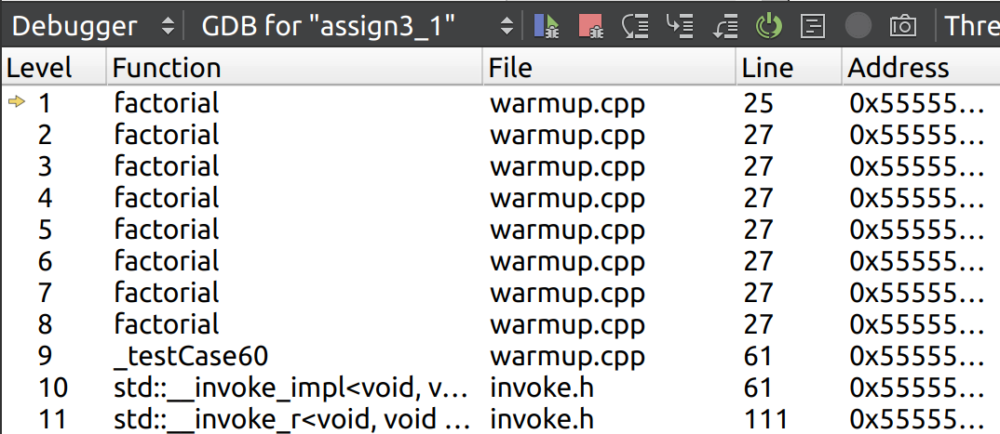
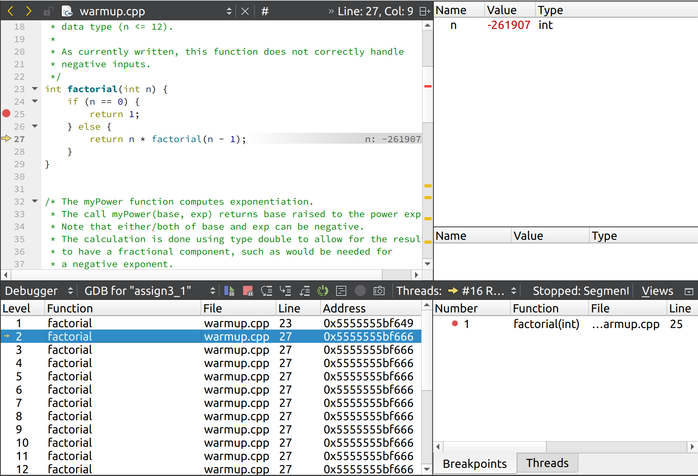

### Q1. 在调试器中查看调用栈，什么可以表明正在调试的程序使用了递归？

答: 重复出现的栈帧，说明函数在调用自身.

### Q2. 从最外层减去最内层的数字，可以得到调用栈最大的栈帧数。你的系统调用栈中有多少个栈帧呢？
答: |(-261907) - (-3)| =  261904

### Q3. 描述无限递归的症状与无限循环的症状有何不同。

无限递归: 因为递归无法终止，栈帧过多导致栈溢出

无限循环: 因为循环无法终止，可能会导致某个数据结构对象太大，内存不足，进而程序终止。也可能重复执行下去，程序永远不会退出。

无限循环并不总是错误，对于基于事件响应的后台应用程序，无限循环是一个常见方案

### Q4. base 和 exp 导致测试失败的是什么情况？

答: base 和 exp 同时为负数

### Q5. 在现有的五种情况下，是否有一些是重叠或多余的？你认为哪些是绝对必要的？有哪些 case 是你不确定的吗？

答: 
绝对有必要的 case: 
- exp = 0, 因为 exp = 0 是 exp 递归的终止条件
- exp > 0, 正常递归，递归终止为 exp = 0
- exp < 0, 如果使用 exp <-- exp -1 进行递归，就需要考虑 exp < 0, 否则会出现无限递归
  
注: 在网络中搜索得到: 

1、0的0次方没有意义。2、0的任意正数次方都是0。3、0的任意负数次方没有意义
根据 exp 的递归计算，当 base = 0, exp > 0 这种有意义的情况下，结果为 0, 所以不需要特殊列出来。

### Q6. 将你的递归解决方案与下面的 checkBalance 迭代方法进行比较。你觉得哪个版本更容易阅读和理解？哪个版本更容易确认正确的行为？

递归的方法更容易理解，每次只负责处理子函数，剩余部分递归处理即可。

递归也更容易确认正确的行为。

### Q7. 假设采用递归实现，粗略估计一下你的系统可以成功合并的最大序列。
假设一个 queue 的元素数目为 M, 另一个 queue 的数目为 N

每次递归操作，都是将其中 queue 的元素取出，存入结果队列。如果结果队列是引用，通过函数参数指定，则结果队列占用栈帧仅为 4 字节 (32-bit 机器)。

如果两个输入队列都是值传入，则每次递归，消耗的字节为 (M + N - k) * 4, 其中 k 为第 k 次递归调用。一共消耗的字节为 \sum_{k=0}^{M+N} (M + N - k) * 4 = (M+N)*(M+N+1)*2

如果栈的最大容量为 2M, 假设 M = N, 则 2N * (2N + 1) * 2 约等于 2*2^20, 得到: N 约为 2^9 

### Q8. 如果试图递归合并一个大于最大值的序列，将会发生什么行为？
答: 栈溢出

