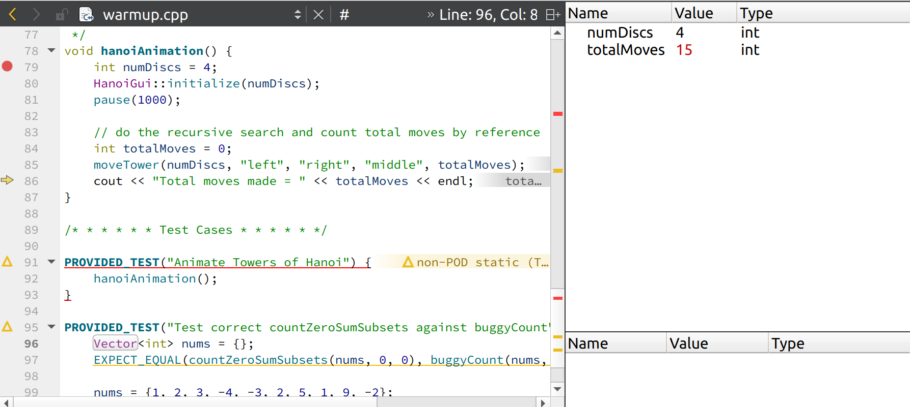
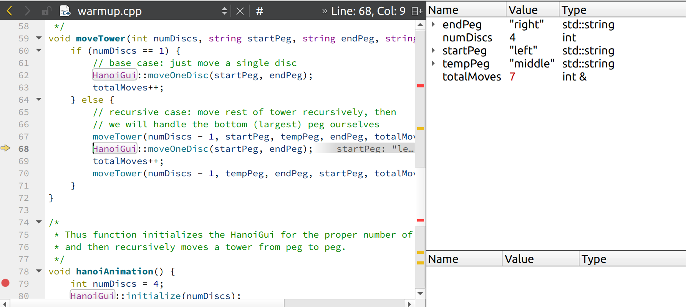
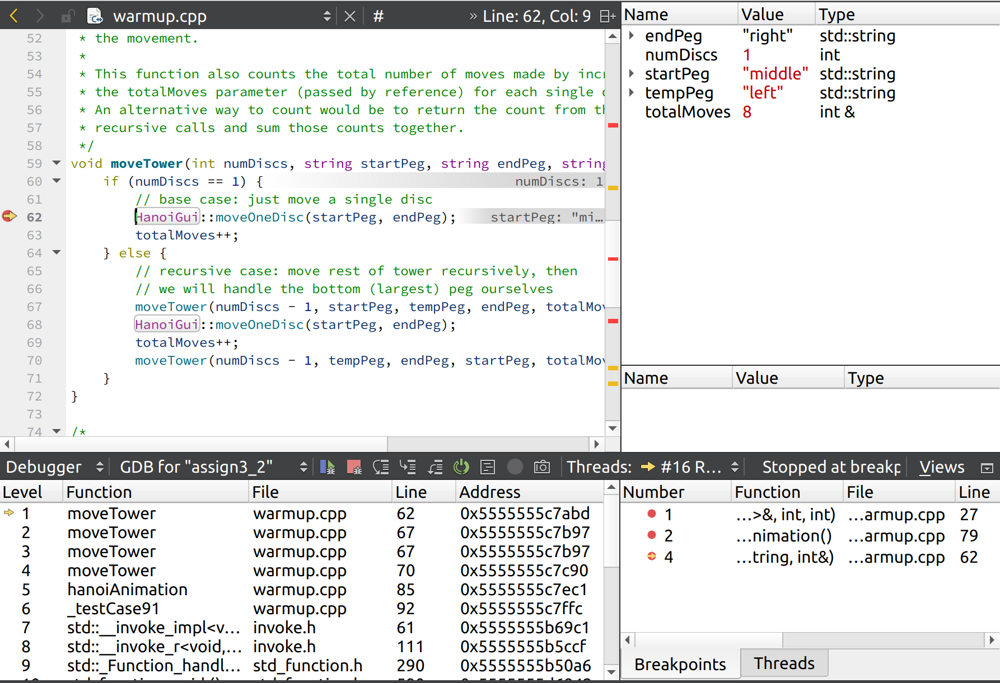
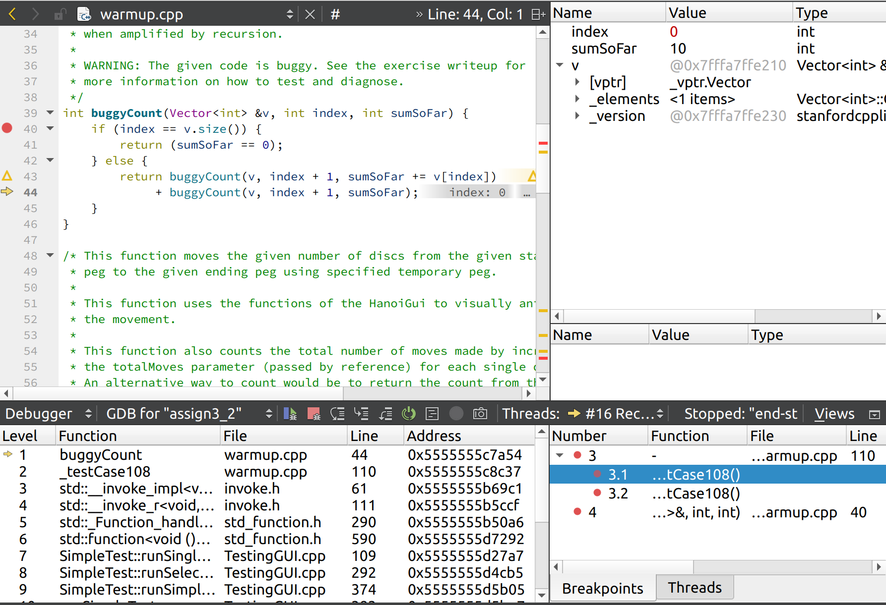

### Q16. 在 hanoiAnimation 中越过 moveTower 调用之后，talMoves 的值是什么？
totalMoves = 15 



### Q17. 在 Step Over 第一个递归子调用之后，totalMoves 变量的值是什么？（换句话说，在 else 语句中，只要 Step Over 第一个递归子调用 moveTower就可以执行 moveTower)

totalMoves = 7 




### Q18. 在 moveTower 的 Base Case 满足时选择 Step Out，你最终会在哪里结束？（你在哪个函数中，行号是多少？）此时，totalMoves 变量的值是多少？



可以看到经过 3 次递归调用 moveTower 后，numDiscs = 1, 满足 base case, totalMoces = 8

### Q19. 你用来触发程序错误的最小可能输入是什么？

首先考虑空集合，显然因为已经满足 base case, 两个函数的结果是一致的。
接着考虑单一元素集合，增加测试代码，发现结果不同

```c++
STUDENT_TEST("Test correct countZeroSumSubsets against buggyCount extended example 2") {
    Vector<int> nums = {10};
    EXPECT_EQUAL(countZeroSumSubsets(nums, 0, 0), buggyCount(nums, 0, 0));
}
```


### Q20. 识别代码中的单字符错误，并解释为什么单字符错误会导致上述测试案例中的错误返回结果。你应该能够具体说明错误是如何导致结果从“完全正确”变为“严重错误”的。



```c++
return buggyCount(v, index + 1, sumSoFar += v[index]) + buggyCount(v, index + 1, sumSoFar);
```

这句话的执行步骤如下: 

1. sumSoFar += v[index]
2. buggyCount(v, index + 1, sumSoFar)
3. buggyCount(v, index + 1, sumSoFar)
4. 2, 3 两步的结果相加

因为步骤 1 修改了 sumSoFar, 因此在执行步骤 3 的时候，实际上计算的也是包括 v[index] 元素的集合，因此2, 3 两步的结果是相同的.


